.. django-excel documentation master file, created by
   sphinx-quickstart on Wed Jan 07 08:46:32 2015.
   You can adapt this file completely to your liking, but it should at least
   contain the root `toctree` directive.

`django-excel` - 格式万变，数据不变
================================================================================

:作者: C.W.
:源文件: http://github.com/pyexcel-webwares/django-excel.git
:提交问题: http://github.com/pyexcel-webwares/django-excel/issues
:许可证: New BSD License
:发布的版本: |version|
:文档生成日期: |today|

以下是一段典型的开发人员和用户的对话::

     用户: "我上传了一个 excel 文件但是你的网页说文件格式不支持。"
  开发人员: "哪你上传的是 xlsx 格式还是 csv 格式？"
     用户: "嗯，我不清楚。总之，我用的微软的 Excel 存的文件。哪一定是 excel 文件啦！"
  开发人员: "嗨，事情是这样：从第一天开始，你就没有告诉我要支持所有的 excel 格式。"
           "要么，将就一下。要么，把项目推迟 N 天。"

**django-excel** 是基于 `pyexcel <https://github.com/pyexcel/pyexcel>`_ 软件库。它的使命是让大家
在网站开发的时候，轻松的在数据存成 excel 文件让用户下载和处理用户上传的 excel 文件。
它可以把 excel 数据转换成二维数组，一维的字典数组和以excel 单页名为关键字，二维数组为值的字典；反之亦然。
这样的话，任由文件格式变化，你都可以在以下三个场景自由做数据转换:

#. excel 文件上传和下载
#. 数据库输入输出
#. excel 数据分析和存储

同时，**django-excel** 有以下两个保证:

#. 不管是任何文件格式，函数界面不变
#. 不管是数据存在哪里，函数界面不变

那么你就可以专注基于 Django 的网站开发了。

最开始的时候，作者遇到一个可用性的问题：当一个简单的 excel 处理的网页交到用户手上的时候，
这些用户，像行政助理，人力资源管理人员，老会抱怨网页不好用。事实上，并不是所有人都知道
csv, xls, xslx 各有什么区别。与其花时间教育用户相关的微软办公室软件的用法，不如把
人类已知 excel 都给支持一下好了。同时为了在不修改代码情况下，我们能够通过装一个
插件就不一个新的 excel 格式支持了，**pyexcel** 的编程界面做了很好的抽象处理。在
整个 Python 社区，此软件包希望成为一个小小的，易装的 Pandas 的替代库。

可圈可点的性能：

#. 为 excel 数据导入数据库和从数据库输出数据为 excel 格式提供一站式服务
#. 把上传的 excel 文件直接转换成 Python 数据结构
#. 把 Python 数据结构转换为 excel 文件让用户下载
#. 在服务器里，把数据存成 excel 文件
#. 支持 csv, tsv, csvz, tsvz 格式。其他格式有以下软件包支持：

.. _file-format-list:
.. _a-map-of-plugins-and-file-formats:

.. table:: 文件格式插件列表

   ======================== ======================= =================
   包包名字                  文件格式                 依赖
   ======================== ======================= =================
   `pyexcel-io`_            csv, csvz [#f1]_, tsv,
                            tsvz [#f2]_
   `pyexcel-xls`_           xls, xlsx(read only),   `xlrd`_,
                            xlsm(read only)         `xlwt`_
   `pyexcel-xlsx`_          xlsx                    `openpyxl`_
   `pyexcel-ods3`_          ods                     `pyexcel-ezodf`_,
                                                    lxml
   `pyexcel-ods`_           ods                     `odfpy`_
   ======================== ======================= =================

.. table:: 专门读或写的插件

   ======================== ======================= =================
   包包名字                  文件格式                 依赖
   ======================== ======================= =================
   `pyexcel-xlsxw`_         xlsx(write only)        `XlsxWriter`_
   `pyexcel-libxlsxw`_      xlsx(write only)        `libxlsxwriter`_
   `pyexcel-xlsxr`_         xlsx(read only)         lxml
   `pyexcel-xlsbr`_         xlsb(read only)         pyxlsb
   `pyexcel-odsr`_          read only for ods, fods lxml
   `pyexcel-odsw`_          write only for ods      loxun
   `pyexcel-htmlr`_         html(read only)         lxml,html5lib
   `pyexcel-pdfr`_          pdf(read only)          camelot
   ======================== ======================= =================

插件使用指南
------------------------

从2020年开始，所有 pyexcel-io 的插件都需要至少 python 3.6 了。如果需要支持以前的
python 版本，请继续使用 0.5.x 。

除了 csv 文件， xls, xlsx 和 ods 文件都是一个压缩文件。里面都是 xml 文件。

只有专门的读写插件可以边读边用或者边转换边写。

如果管理所有已经装上了的插件呢？很简单，你可以用 pip 添加需要的插件，或者卸载不需要的插件。
如果你有不同的项目，而且项目的依赖不一样，作者推荐用 python 的 venv 来给你的每一个项目创建
一个新的虚拟 python 环境。有个别情况，两个插件需要共存，比如 pyexcel-ods 和 pyexcel-odsr，
前者可以写 ods 文件，但你需要后者来读 ods 文件。在这种情形下呢，你可以用 library 变量，
比如 get_array('my.ods', library='pyexcel-odsr')。

.. _pyexcel-io: https://github.com/pyexcel/pyexcel-io
.. _pyexcel-xls: https://github.com/pyexcel/pyexcel-xls
.. _pyexcel-xlsx: https://github.com/pyexcel/pyexcel-xlsx
.. _pyexcel-ods: https://github.com/pyexcel/pyexcel-ods
.. _pyexcel-ods3: https://github.com/pyexcel/pyexcel-ods3
.. _pyexcel-odsr: https://github.com/pyexcel/pyexcel-odsr
.. _pyexcel-odsw: https://github.com/pyexcel/pyexcel-odsw
.. _pyexcel-pdfr: https://github.com/pyexcel/pyexcel-pdfr

.. _pyexcel-xlsxw: https://github.com/pyexcel/pyexcel-xlsxw
.. _pyexcel-libxlsxw: https://github.com/pyexcel/pyexcel-libxlsxw
.. _pyexcel-xlsxr: https://github.com/pyexcel/pyexcel-xlsxr
.. _pyexcel-xlsbr: https://github.com/pyexcel/pyexcel-xlsbr
.. _pyexcel-htmlr: https://github.com/pyexcel/pyexcel-htmlr

.. _xlrd: https://github.com/python-excel/xlrd
.. _xlwt: https://github.com/python-excel/xlwt
.. _openpyxl: https://bitbucket.org/openpyxl/openpyxl
.. _XlsxWriter: https://github.com/jmcnamara/XlsxWriter
.. _pyexcel-ezodf: https://github.com/pyexcel/pyexcel-ezodf
.. _odfpy: https://github.com/eea/odfpy
.. _libxlsxwriter: http://libxlsxwriter.github.io/getting_started.html

.. table:: 其他的格式

   ======================== ======================= ================= ==================
   包包名字                  文件格式                 依赖               Python 版本
   ======================== ======================= ================= ==================
   `pyexcel-text`_          write only:rst,         `tabulate`_       2.6, 2.7, 3.3, 3.4
                            mediawiki, html,                          3.5, 3.6, pypy
                            latex, grid, pipe,
                            orgtbl, plain simple
                            read only: ndjson
                            r/w: json
   `pyexcel-handsontable`_  handsontable in html    `handsontable`_   same as above
   `pyexcel-pygal`_         svg chart               `pygal`_          2.7, 3.3, 3.4, 3.5
                                                                      3.6, pypy
   `pyexcel-sortable`_      sortable table in html  `csvtotable`_     same as above
   `pyexcel-gantt`_         gantt chart in html     `frappe-gantt`_   except pypy, same
                                                                      as above
   ======================== ======================= ================= ==================

.. _pyexcel-text: https://github.com/pyexcel/pyexcel-text
.. _tabulate: https://bitbucket.org/astanin/python-tabulate
.. _pyexcel-handsontable: https://github.com/pyexcel/pyexcel-handsontable
.. _handsontable: https://cdnjs.com/libraries/handsontable
.. _pyexcel-pygal: https://github.com/pyexcel/pyexcel-chart
.. _pygal: https://github.com/Kozea/pygal
.. _pyexcel-matplotlib: https://github.com/pyexcel/pyexcel-matplotlib
.. _matplotlib: https://matplotlib.org
.. _pyexcel-sortable: https://github.com/pyexcel/pyexcel-sortable
.. _csvtotable: https://github.com/vividvilla/csvtotable
.. _pyexcel-gantt: https://github.com/pyexcel/pyexcel-gantt
.. _frappe-gantt: https://github.com/frappe/gantt

.. rubric:: Footnotes

.. [#f1] 压缩了的 csv 文件
.. [#f2] 压缩了的 tsv 文件

既然有了 pyexcel , 为什么我还要装 django-excel ？

#. **加快上传文件处理速度**.  **django-excel** 通过 ExcelMemoryFileUploadHandler 和 TemporaryExcelFileU
   ploadHandler 让你直接处理上传的文件。 MemoryFileUploadHandler 把上传的文件存在内存里，这样呢 django-excel
   可以直接从内存读取上传文件。 TemporaryExcelFileUploadHandler 呢，是把上传文件存在临时文件中，django-excel
   则是直接读临时文件。到底是哪个类被 Django 调用呢？是有 FILE_UPLOAD_MAX_MEMORY_SIZE 决定的。如果上传
   文件小于这个最大值，那么 django 会把上传文件存在内存里。否则，就存在临时文件里。

#. **直接把上传数据存入数据库**. **django-excel** 用批量方式（ bulk_insert ）把你的数据导入你的 django model.

安装
-------------------

你可以通过 pip 安装 django-excel ：

.. code-block:: bash

    $ pip install django-excel

或者复制到本地再安装：

.. code-block:: bash

    $ git clone https://github.com/pyexcel-webwares/django-excel.git
    $ cd django-excel
    $ python setup.py install

每个插件的安装方法都有各自的文档。拿 xlsx 为例，你需要装 pyexcel-xlsx ::

        $ pip install pyexcel-xlsx

一反 Django 开箱即用的理念，django-excel 需要开发人员自己选择所需 pyexcel 的套件。主要原因是，
第三方软件 xlwt, openpyxl, odfpy 也是会拉长下载速度和占用磁盘空间。

配置
------------------------

You will need to update your *settings.py*:

.. code-block:: python

    FILE_UPLOAD_HANDLERS = ("django_excel.ExcelMemoryFileUploadHandler",
                            "django_excel.TemporaryExcelFileUploadHandler")

测试过的 Django 版本
--------------------------------------------------------------------------------

2.1, 2.0.8, 1.11.15, 1.10.8, 1.9.13, 1.8.18, 1.7.11, 1.6.11

从2015年3月15日之后，python 2.6 就再也没有测试过了

更多的文件格式
------------------------

实例项目支持 csv, tsv 和他们的压缩版本: csvz and tsvz. 如果你需要其他的格式支持，
请参照:ref:`file-format-list`，你可以装一个或所有的::

    pip install pyexcel-xls
    pip install pyexcel-xlsx
    pip install pyexcel-ods

新手起步指南
--------------------------------------------------------------------------------

为了让大家能轻松上手呢，作者给大家一步一步介绍 django-excel 自己的测试项目。所以，请先复制
一下`整个项目 <https://github.com/pyexcel/django-excel>`_ ，我们一起做::

    git clone https://github.com/pyexcel/django-excel.git

整个测试项目是按照 Django 的指南的第 `一 <https://docs.djangoproject.com/en/1.11/intro/tutorial01/>`_,
`二 <https://docs.djangoproject.com/en/1.11/intro/tutorial02/>`_，
`三 <https://docs.djangoproject.com/en/1.11/intro/tutorial03/>`_ 部分写的。
所以，作者就不最述了。如果大家想自己从零开始呢，请移步到 Django 指南，做完第三部分，再回来。

当你在本地有了项目代码呢，请进入 django-excel 目录并装上所有的软件包::

    $ cd django-excel
    $ pip install -r requirements.txt
    $ pip install -r tests/requirements.txt

然后运行服务器::

    $ python manage.py runserver
    Performing system checks...

    System check identified no issues (0 silenced).

    You have 9 unapplied migration(s). Your project may not work properly until you apply the migrations for app(s): admin, auth, contenttypes.
    Run 'python manage.py migrate' to apply them.

    July 06, 2017 - 08:29:10
    Django version 1.11.3, using settings 'mysite.settings'
    Starting development server at http://127.0.0.1:8000/
    Quit the server with CONTROL-C.

.. note::

   我们暂且忽略 9 未执行的迁徙。因为此指南的目的是让大家上手。

把上传的 excel 文件变成 csv 文件下载
++++++++++++++++++++++++++++++++++++++++++++++++++++++++++++++++++++++++++++++++

我们来看看处理 excel 文件上传和 excel 文件下载的例子。用你的浏览器打开这个链接：
http://localhost:8000/polls/, 你应该可以看到下面这个上传表格：

.. image :: upload-form.png

然后选择一个 xls 文件，然后按 "Submit". 你会得到一个 csv 的下载文件。

.. image :: download-file.png

我们看看源文件吧
`polls/views.py <https://github.com/pyexcel/django-excel/blob/master/polls/views.py#L14>`_
:

.. literalinclude:: ../../polls/views.py
   :lines: 14-36

**UploadFileForm** 是 django 的一个文件上传模块。然后往下看 **filehandle**.
它可能是 ExcelInMemoryUploadedFile
或是 TemporaryUploadedExcelFile。它们两个都继承了 ExcelMixin， 所以它们都又有
以下的函数，比如 get_sheet, get_array 。

把 excel 文件做为下载的函数, :meth:`~django_excel.make_response` 能把
由 :meth:`~django_excel.ExcelMixin.get_sheet` 得到
:class:`pyexcel.Sheet` 实例转换成可以下载的 csv 文件。

你可以自己试试其他的函数 :ref:`the mapping table <data-types-and-its-conversion-funcs>`.

处理数据输入
++++++++++++++++++++++++++++++++++++++++++++++++++++++++++++++++++++++++++++++++

这个例子展示如何把上传的 excel 的内容直接输入数据库。
`sample-data.xls <https://github.com/pyexcel/django-excel/blob/master/sample-data.xls>`_ 是我们
样上传的文件。

.. pyexcel-table:: ../../sample-data.xls

以下是我们的数据库 tables: 

.. literalinclude:: ../../polls/models.py
   :lines: 4-

.. note::
   除了 "slug" 属性, **Question** 和 **Choice** 都是从 Django 指南第一部分抄下来的。

好了，打开链接 http://localhost:8000/polls/import/, 下面的文件上传页面：

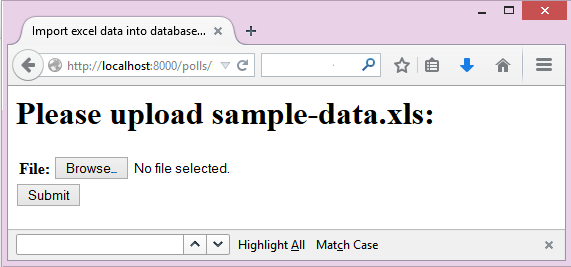

再上传 `sample-data.xls <https://github.com/pyexcel/django-excel/blob/master/sample-data.xls>`_ 。
同时你会得到一个网页，里面显示了收到的数据。

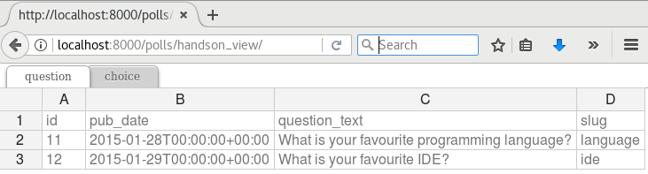

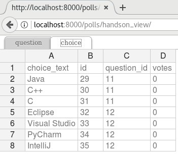

.. note ::

   pyexcel-handsontable 是 pyexcel 0.5.0 之后写的。它给用户带来 excel 一样的数据展示。
   在网站开发的时候，这个数据显示很上手。我后面会继续提到。

再去 Django 的管理员界面 http://localhost:8000/admin/polls/question,
你会发现 question 已经有数据了：

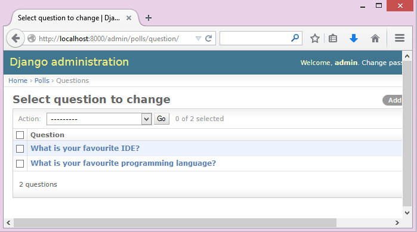

.. note::
   管理员界面的用户名是： admin。密码是: admin 。

再看看 choice:

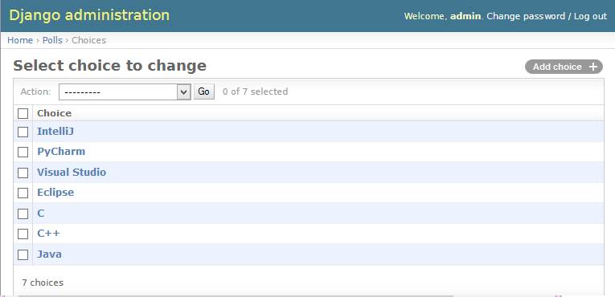

.. note::

    你可以用管理员界面不数据都删了，再重复上传一次。

现在，我们来读一下源代码 `polls/views.py <https://github.com/pyexcel/django-excel/blob/master/polls/views.py#L79>`_
请关注这部分代码：

.. literalinclude:: ../../polls/views.py
   :lines: 72-92

把上传的 excel 存入数据库的功臣是 :meth:`~django_excel.save_book_to_database`.
函数变量 **models** 是 django model 数组； **initializers** 是与之对应的初始化函数。
在代码中，你会注意到，作者没有给 Question 写初始化函数，所以就给了 None；但是把 `choice_func`
给了 Choice。**mapdicts** 是一个用来控制数列栏名字的数组。 它的成员可以是一个数组，也
可以是一个字典::

    {
      "Question Text": "question_text",
      "Publish Date": "pub_date",
      "Unique Identifier": "slug"
    }

`choice_func` 是必须写的，因为 **Choice** 有一个外键对应 **Question**.
**Choice** 的 "Question" 属性需要已经存入数据库的一个主键。在我们的例子里，“Sheet 2" 的
"Question" 一栏就必须和 "Sheet 1" 的 Question 是一一对应的关系。

处理数据导出
++++++++++++++++++++++++++++++++++++++++++++++++++++++++++++++++++++++++++++++++

我们再来具体看看如何把数据库里的表输出成 excel 文件。现在打开链接：
http://localhost:8000/polls/export/book，这次呢，一个下载对话框直接就跳出来了:

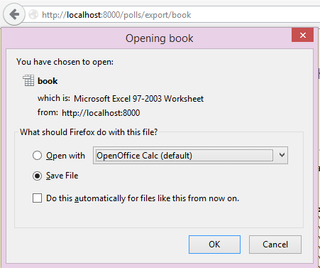

把它存下来，然后打开看看。下载的数据看起来像这样:

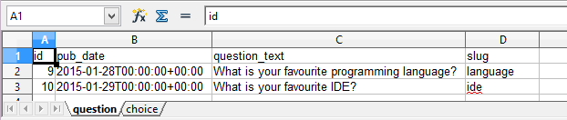
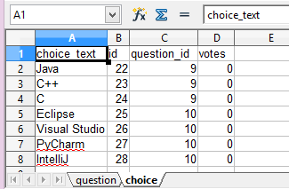

哪我们回头看看代码是怎么实现的:
`polls/views.py <https://github.com/pyexcel/django-excel/blob/master/polls/views.py#L48>`_:

.. literalinclude:: ../../polls/views.py
   :lines: 49-56

:meth:`~django_excel.make_response_from_tables` 其实做了所有的事情: 读取数据，
把它们转换成 xls，再发给浏览器。做为开发人员，你需要给出要输出的表和 excel 文件类型。

与此同时，你还可打开另外一个链接： http://localhost:8000/polls/export/sheet 。它会把 **Question**
输出成一个单页的表格文件。

直接把 excel 文件渲染成 excel 的样子
++++++++++++++++++++++++++++++++++++++++++++++++++++++++++++++++++++++++++++++++

最开始已经出现了这个渲染的形式。首先呢，`handsontable 开发人员 <https://handsontable.com/>`_ 做了
所有的工作。其次 `pyexcel-handsontable`_ 仅仅做了集成而已。 想要用这个的话，你需要自己装::

   $ pip install pyexcel-handsontable

现在，我们看看这个是如何调用的。简单地说，就是把输出的文件后最写成: 'handsontable.html' 就可以了。

.. literalinclude:: ../../polls/views.py
   :lines: 153-155

你可以把 handontable 文件嵌入 django 的模版里面。下面是所需的代码：

.. literalinclude:: ../../polls/views.py
   :lines: 158-189

你可以打开这两个链接预览一下： http://localhost:8000/polls/embedded_handson_view/
and http://localhost:8000/polls/embedded_handson_view_single/.

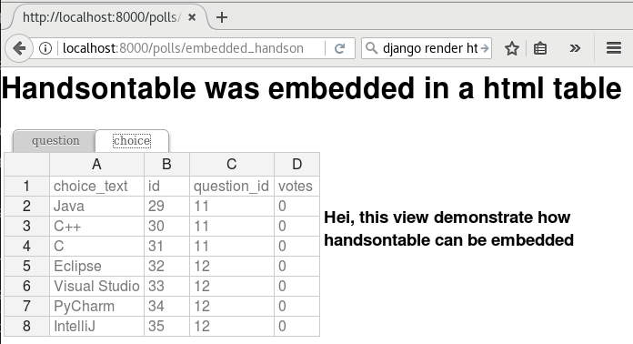

如何输入单个表格呢
********************************************************************************

我们开始之前，请用 django 的管理员界面，清空 question 和 choice 。

前面讲了如何把一个多表格的 excel 文件里的数据输入数据库。 现在我们看看输入一个表格。
打开这个链接：http://localhost:8000/polls/imports_sheet/, w
这次上传 `sample-sheet.xls <https://github.com/pyexcel/django-excel/blob/master/sample-sheet.xls>`_
然后 django 管理员界面可以查看是否有收到数据。

下面我们来读代码：

.. literalinclude:: ../../polls/views.py
   :lines: 104-116

因为是单个表格，所以我们给一个 mapdict 参数并调用
:meth:`~django_excel.ExcelMixin.save_to_database` 来存到一个 django 模型里。

看到了多了一个参数 'name_columns_by_row' 吗？为什么需要它？
是这样的，一般来讲，如果你的表格的第一行是栏目名字呢，你就不需要它。 
在这个示例里， 栏目名故意放在了第二行。你可以打开
`sample-sheet.xls <https://github.com/pyexcel/django-excel/blob/master/sample-sheet.xls>`_
查看一下。

.. note::

   如果你忘了清空数据的话呢，你会得到一下的错误输出::

       Warning: Bulk insertion got below exception. Trying to do it one by one slowly.
       column slug is not unique <- reason
       One row is ignored <- action
       column slug is not unique
       What is your favourite programming language?
       One row is ignored
       column slug is not unique
       What is your favourite IDE?

   这是因为数据库里已经有相同数据了，Django 就会报 IntegrityError. 具体请读
   `这部分 pyexcel-io 的代码 <https://github.com/pyexcel/pyexcel-io/blob/master/pyexcel_io/djangobook.py#L98>`_,
   和 `django-excel 问题 2 <https://github.com/pyexcel/django-excel/issues/2>`_

   为了除去这个警告呢，你需要在 django 的管理员界面清空所有数据。然后再试一下。

如果 excel 数据里有一些与数据库数据重叠了，怎么办？
********************************************************************************

你可以提供自己的一个初始化函数。这个数在遇到重叠的数据的时候，返回 None 这样 django-excel 
就会跳过当前的一行数据。
当然，在初始化函数里，你也可以更新数据库。最重要的是，只有你的初始化函数返回 None，
django-excel 会尽量用批量输入，而不是一个一个输入数据库。

处理自定义数据输出
+++++++++++++++++++++++++++++++

有时候，应用户要求呢，我们会下载数据库表的一部分。这个时候，作为开发人员，你可以用
:meth:`~django_excel.make_response_from_query_sets` 来产生一个 excel 文件:

.. literalinclude:: ../../polls/views.py
   :lines: 49, 56-65

你可以打开 http://localhost:8000/polls/export/custom 试试看看：

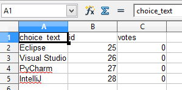

渲染你的数据
++++++++++++++++++++++++++++++++++++++++++++++++++++++++++++++++++++++++++++++++

为了渲染数据，我们先去 django 的管理员界面，增加一些投票。

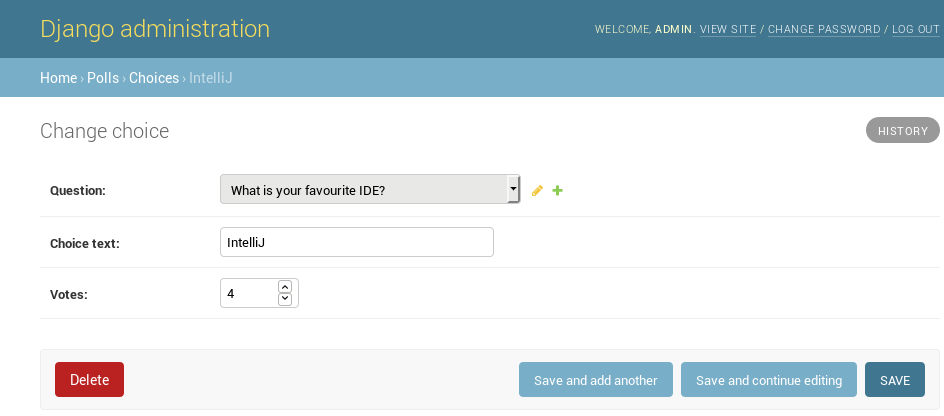

看看，这个是我改的：

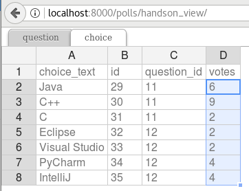

现在，我们来看看这个问卷调查的结果(http://localhost:8000/polls/survey_result/)
"What's your favorite IDE?":

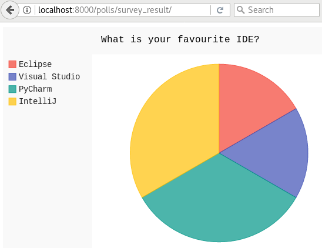

`pyexcel-pygal`_ 是 pyexcel 的一个插件，可以用来展示一些常用图表。下面是所需要的代码：

.. literalinclude:: ../../polls/views.py
   :lines: 192-217

.. _data-types-and-its-conversion-funcs:

所有支持的数据结构
--------------------------

示例应用展示了数列，并不代表只有数列，其他的数据结构也是支持的。 以下是所有的数据结构列表:

============================================== ======================================================== ===================================================
数据结构                                          从文件到数据结构                                           从数据结构到 http 回复
============================================== ======================================================== ===================================================
字典(dict)                                      :meth:`~django_excel.ExcelMixin.get_dict`                :meth:`~django_excel.make_response_from_dict`
字典列表（records)                               :meth:`~django_excel.ExcelMixin.get_records`             :meth:`~django_excel.make_response_from_records`
二维数组（a list of lists）                      :meth:`~django_excel.ExcelMixin.get_array`               :meth:`~django_excel.make_response_from_array`
以二维数组为值的字典(dict of a list of lists)     :meth:`~django_excel.ExcelMixin.get_book_dict`           :meth:`~django_excel.make_response_from_book_dict`
:class:`pyexcel.Sheet`                         :meth:`~django_excel.ExcelMixin.get_sheet`               :meth:`~django_excel.make_response`
:class:`pyexcel.Book`                          :meth:`~django_excel.ExcelMixin.get_book`                :meth:`~django_excel.make_response`
数据库表(database table)                       :meth:`~django_excel.ExcelMixin.save_to_database`         :meth:`~django_excel.make_response_from_a_table`
                                               :meth:`~django_excel.ExcelMixin.isave_to_database`
一组数据库表(a list of database tables)        :meth:`~django_excel.ExcelMixin.save_book_to_database`    :meth:`~django_excel.make_response_from_tables`
                                               :meth:`~django_excel.ExcelMixin.isave_book_to_database`
数据库查询（a database query sets）                                                                       :meth:`~django_excel.make_response_from_query_sets`
字典产生器（a generator for records）            :meth:`~django_excel.ExcelMixin.iget_records`
数组产生器（a generator of lists）               :meth:`~django_excel.ExcelMixin.iget_array`
============================================== ======================================================== ===================================================

需要更多信息的话，可以参照 :ref:`pyexcel documentation<pyexcel:a-list-of-data-structures>`

支持
-----------------------

If your company has embedded pyexcel and its components into a revenue generating
product, please support me on github, `patreon <https://www.patreon.com/bePatron?u=5537627>`_
or `bounty source <https://salt.bountysource.com/teams/chfw-pyexcel>`_ to maintain
the project and develop it further.

If you are an individual, you are welcome to support me too and for however long
you feel like. As my backer, you will receive
`early access to pyexcel related contents <https://www.patreon.com/pyexcel/posts>`_.

And your issues will get prioritized if you would like to become my patreon as `pyexcel pro user`.

With your financial support, I will be able to invest
a little bit more time in coding, documentation and writing interesting posts.

函数参考
---------------

**django-excel** attaches **pyexcel** functions to **InMemoryUploadedFile** and **TemporaryUploadedFile**. Hence, the following functions are available for the uploaded files, e.g. request.FILES['your_uploaded_file'].

.. module:: django_excel.ExcelMixin

.. method:: get_sheet(sheet_name=None, **keywords)

   :param sheet_name: For an excel book, there could be multiple sheets. If it is left
                      unspecified, the sheet at index 0 is loaded. For 'csv', 'tsv' file,
                      *sheet_name* should be None anyway.
   :param keywords: additional keywords to :meth:`pyexcel.get_sheet`
   :returns: A sheet object

.. method:: get_array(sheet_name=None, **keywords)

   :param sheet_name: same as :meth:`~django_excel.ExcelMixin.get_sheet`
   :param keywords: additional keywords to pyexcel library
   :returns: a two dimensional array, a list of lists

.. method:: iget_array(sheet_name=None, **keywords)

   :param sheet_name: same as :meth:`~django_excel.ExcelMixin.get_sheet`
   :param keywords: additional keywords to pyexcel library
   :returns: a generator for a two dimensional array, a list of lists

.. method:: get_dict(sheet_name=None, name_columns_by_row=0, **keywords)

   :param sheet_name: same as :meth:`~django_excel.ExcelMixin.get_sheet`
   :param name_columns_by_row: uses the first row of the sheet to be column headers by default.
   :param keywords: additional keywords to pyexcel library
   :returns: a dictionary of the file content

.. method:: get_records(sheet_name=None, name_columns_by_row=0, **keywords)

   :param sheet_name: same as :meth:`~django_excel.ExcelMixin.get_sheet`
   :param name_columns_by_row: uses the first row of the sheet to be record field names by default.
   :param keywords: additional keywords to pyexcel library
   :returns: a list of dictionary of the file content

.. method:: iget_records(sheet_name=None, name_columns_by_row=0, **keywords)

   :param sheet_name: same as :meth:`~django_excel.ExcelMixin.get_sheet`
   :param name_columns_by_row: uses the first row of the sheet to be record field names by default.
   :param keywords: additional keywords to pyexcel library
   :returns: a generator for a list of dictionary of the file content

.. method:: get_book(**keywords)

   :param keywords: additional keywords to pyexcel library
   :returns: a two dimensional array, a list of lists

.. method:: get_book_dict(**keywords)

   :param keywords: additional keywords to pyexcel library
   :returns: a two dimensional array, a list of lists

.. method:: save_to_database(model=None, initializer=None, mapdict=None, **keywords)

   :param model: a django model
   :param initializer: a custom table initialization function if you have one
   :param mapdict: the explicit table column names if your excel data do not have the exact column names
   :param keywords: additional keywords to :meth:`pyexcel.Sheet.save_to_django_model`

.. method:: isave_to_database(model=None, initializer=None, mapdict=None, **keywords)

   similar to :meth:`~django_excel.ExcelMixin.save_to_database`. But it requires
   less memory.

   This requires column names must be at the first row.

.. method:: save_book_to_database(models=None, initializers=None, mapdicts=None, **keywords)

   :param models: a list of django models
   :param initializers: a list of model initialization functions.
   :param mapdicts: a list of explicit table column names if your excel data sheets do not have the exact column names
   :param keywords: additional keywords to :meth:`pyexcel.Book.save_to_django_models`

.. method:: isave_book_to_database(models=None, initializers=None, mapdicts=None, **keywords)

   similar to :meth:`~django_excel.ExcelMixin.save_book_to_database`. But it requires
   less memory.

   This requires column names must be at the first row in each sheets.

.. method:: free_resources()

   It should be called after iget_array and iget_records were used

Response methods
-----------------

.. module:: django_excel

.. method:: make_response(pyexcel_instance, file_type, status=200)

   :param pyexcel_instance: :class:`pyexcel.Sheet` or :class:`pyexcel.Book`
   :param file_type: one of the following strings:

                     * 'csv'
                     * 'tsv'
                     * 'csvz'
                     * 'tsvz'
                     * 'xls'
                     * 'xlsx'
                     * 'xlsm'
                     * 'ods'

   :param status: unless a different status is to be returned.

.. method:: make_response_from_array(array, file_type, status=200)

   :param array: a list of lists
   :param file_type: same as :meth:`~django_excel.make_response`
   :param status: same as :meth:`~django_excel.make_response`

.. method:: make_response_from_dict(dict, file_type, status=200)

   :param dict: a dictionary of lists
   :param file_type: same as :meth:`~django_excel.make_response`
   :param status: same as :meth:`~django_excel.make_response`

.. method:: make_response_from_records(records, file_type, status=200)

   :param records: a list of dictionaries
   :param file_type: same as :meth:`~django_excel.make_response`
   :param status: same as :meth:`~django_excel.make_response`

.. method:: make_response_from_book_dict(book_dict, file_type, status=200)

   :param book_dict: a dictionary of two dimensional arrays
   :param file_type: same as :meth:`~django_excel.make_response`
   :param status: same as :meth:`~django_excel.make_response`

.. method:: make_response_from_a_table(model, file_type status=200)
   Produce a single sheet Excel book of *file_type*

   :param model: a Django model
   :param file_type: same as :meth:`~django_excel.make_response`
   :param status: same as :meth:`~django_excel.make_response`

.. method:: make_response_from_query_sets(query_sets, column_names, file_type status=200)

   Produce a single sheet Excel book of *file_type* from your custom database queries

   :param query_sets: a query set
   :param column_names: a nominated column names. It could not be None, otherwise no data is returned.
   :param file_type: same as :meth:`~django_excel.make_response`
   :param status: same as :meth:`~django_excel.make_response`

.. method:: make_response_from_tables(models, file_type status=200)

   Produce a multiple sheet Excel book of *file_type*. It becomes the same
   as :meth:`~django_excel.make_response_from_a_table` if you pass *tables*
   with an array that has a single table

   :param models: a list of Django models
   :param file_type: same as :meth:`~django_excel.make_response`
   :param status: same as :meth:`~django_excel.make_response`
